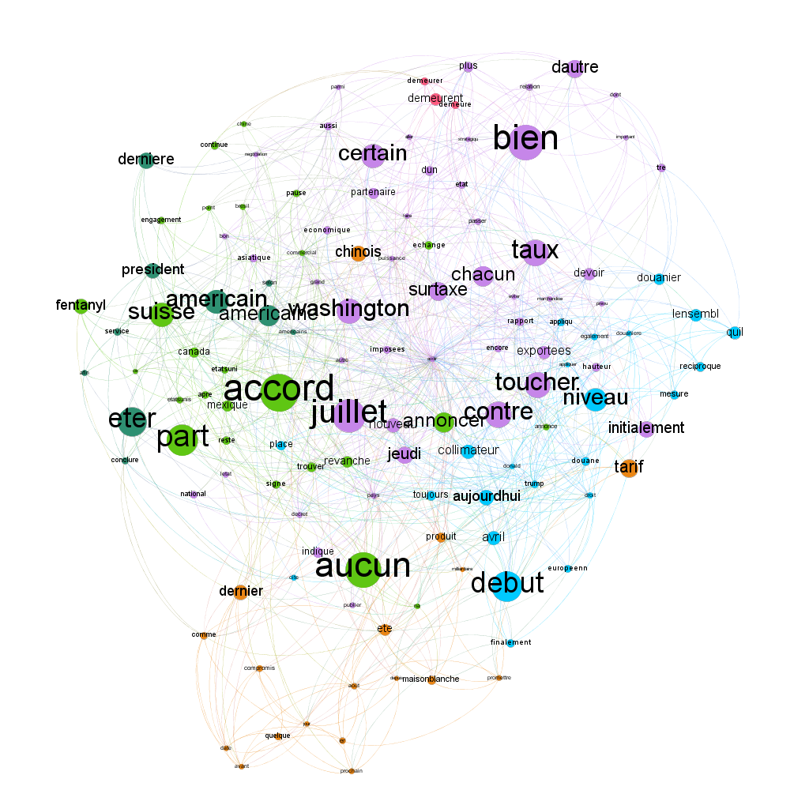

# ArticleViz
# 🌐 Analyse de réseau avec Gephi et Python

Ce projet vise à visualiser et explorer un réseau hybride à partir d’un corpus textuel à l’aide de Python et Gephi.

## 📁 Contenu du projet

- `art2.txt` : Corpus utilisé pour générer le réseau
- `hybrid_network.csv` : Fichier principal des arêtes du réseau
- `nodes_with_frequency.csv` : Liste des nœuds avec leur fréquence d'apparition
- `script.py` : Script complet pour le nettoyage du texte, embeddings, réduction de dimension avec UMAP, et export du réseau
- `graph_output.png` *(optionnel)* : Capture de la visualisation finale dans Gephi

## 🔧 Étapes du processus

1. Nettoyage du corpus textuel
2. Création d’un réseau basé sur la cooccurrence des termes
3. Embeddings vectoriels avec FastText
4. Réduction de dimension (UMAP)
5. Visualisation interactive avec Gephi

## 🎯 Objectif

Explorer les relations sémantiques dans un corpus textuel en combinant outils de traitement automatique du langage (NLP), visualisation et analyse de réseaux.

## 🧠 Outils et bibliothèques

- `fasttext`
- `umap-learn`
- `pandas`, `numpy`
- Gephi

---

Tu veux que je t’aide aussi à créer la structure des fichiers du dépôt, ou que je t’ajoute une section bonus sur comment reproduire le projet étape par étape ? 💡
